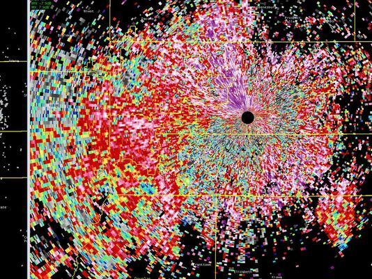

**Note: This project currently compiles and evaluates a distributed program, however I'm still working on getting the plotting to produce something useful. I also want to rework how conditional evaluation works**



# diagram

A DAG-based evaluation system for distributed computation that handles partial order and atomicity of evaluation.

Programs are modeled as a directed acyclic graph where nodes represent atomically evaluated units and edges are dependencies between them, expressed as a partial order. Subgraphs can themselves be nodes by declaring atomicity of that group.
Machines are analogous to chains or state machines. Each machine can lock and free resources, commit operations, and rescind on failure to free remote resource locks. The runtime behavior of individual machines is set explicitly to examine simulated failure scenerios.

## Install and Run

Clone the repo and then run the following command to create the nix environment and build the executable:

```bash
nix develop
```

You can build and run the executable with:

```bash
nix run
```

### Train-Hotel Problem

This test simulates a scenario where a train booking to a city must be made atomically with a hotel in in that city. The program ensures making exactly one successful atomic booking, i.e. there is a partial order between booking attempts. The system first attempts to book a train and hotel in Berlin. If this attempt fails due to machine failure, the system unwinds any ticket holds and attempts to book a train and hotel in Amsterdam. Machines represent the entities responsible for performing actions such as placing holds, booking resources, and releasing holds.
