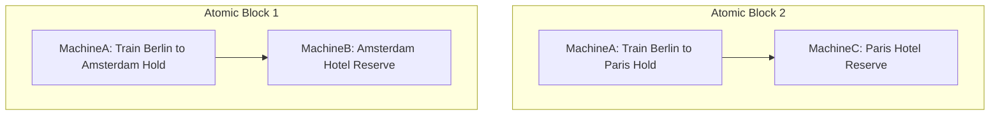

# diagram


## Overview
A DAG-based evaluation system for distributed computation that handles subgraph dependency and atomicity.

Programs are modeled as a directed acyclic graph (DAG) where nodes represent atomically evaluated units and edges are dependencies between nodes expressed as a partial order. Subgraphs can themselves be nodes by declaring atomicity of that group.
Machines are distinct concept, analogous to an independent state machine. Each machine can lock resources, commit operations, rollback on failure, and send messages to free remote resources.

The program graph defined in the configuration json file has two abstractions:
  - `Concurrency`: sibling nodes in Concurrent blocks are not dependent and can run independent of one another
  - `Atomicity`: all tasks in an Atomic block must succeed, or the entire block rolls back

**Environment Preparation**
The environment is prepared by reading a configuration file that defines the machines and the DAG (Directed Acyclic Graph) structure. The configuration is parsed and converted into a graph representation.

**Machine Initialization**
Machines are initialized with their respective MachineIDs, program subgraphs, the latency at which they operate, and their accepted timeouts. Each machine is responsible for executing specific tasks defined in the DAG.

**Program Evaluation**
The DAG is executed node-by-node, respecting dependencies and block constraints. Computations are executed on the correct machines via `scheduleMachine`. Rollbacks are triggered when a timeout or failure occurs, ensuring consistent system state.

## Files
- **`Main.hs`**: Main entry point of the program. Reads a configuration file, initializes the DAG, schedules tasks on machines, and executes the computation.
- **`ProgramInstantiation.hs`**: Converts the configuration file into machine configurations and program schedules that are used to initialize the program environment.
- **`ProgramEvaluation.hs`**: Implements the evaluation logic, including atomicity, concurrency, rollbacks, and freeing.
- **`Spec.hs`**: Defines the test suite for validating program behavior.
- **`TrainHotelRetry.json`**: Simulates a retry scenario where the first booking attempt fails due to a timeout, and the second booking attempt succeeds.

## Install and Run
Clone the repo and run the following command to create a development shell with all the necessary dependencies:
```bash
nix develop
```
Run the Application with a configuration file that includes the node setup and program definition:
```bash
nix run .#diagram -- <path-to-config.json>
```

### Train Hotel Test
This test simulates a scenario where a train booking from Berlin to Amsterdam must be made atomically with a hotel in Amsterdam. If this booking fails due to a timeout, a second attempt is made to atomically book a train from Berlin to Paris with a hotel in Paris.


```mermaid
graph TD
    subgraph Atomic Block 2
        C[MachineA: Train Berlin to Paris Hold]
        D[MachineC: Paris Hotel Reserve]
        C --> D
    end
    subgraph Atomic Block 1
        A[MachineA: Train Berlin to Amsterdam Hold]
        B[MachineB: Amsterdam Hotel Reserve]
        A --> B
    end
```

Run the tests with the following:
```bash
nix develop --command hspec
```
Expected terminal output:
```yaml
Begin program evaluation
MachineID: MachineA
Latency: 100
Timeout: 400
Subgraph: Node "MachineA" (DistributedIO {lock = <function>, commit = <function>, rollback = <function>, free = <function>}) [Node "MachineB" (DistributedIO {lock = <function>, commit = <function>, rollback = <function>, free = <function>}) []]
MachineID: MachineA
Latency: 100
Timeout: 400
Subgraph: Node "MachineA" (DistributedIO {lock = <function>, commit = <function>, rollback = <function>, free = <function>}) [Node "MachineC" (DistributedIO {lock = <function>, commit = <function>, rollback = <function>, free = <function>}) []]
Machine MachineA locking: Train Berlin to Amsterdam Hold
Machine MachineB locking: Amsterdam Hotel Reserve
Machine MachineA rolling back: Train Berlin to Amsterdam Hold Canceled
Machine MachineB rolling back: Amsterdam Hotel Reservation Canceled
Machine MachineA locking: Train Berlin to Paris Hold
Machine MachineC locking: Paris Hotel Reserve
Machine MachineA committing: Train Berlin to Paris Hold
Machine MachineC committing: Paris Hotel Reserve
Evaluating distributed computation...
Computation succeeded: ["Committed by MachineA: Train Berlin to Paris Hold","Committed by MachineC: Paris Hotel Reserve"]

Distributed Computation Framework
  retries Train and Hotel Booking after initial failure

Finished in 0.0123 seconds
1 example, 0 failures
```
